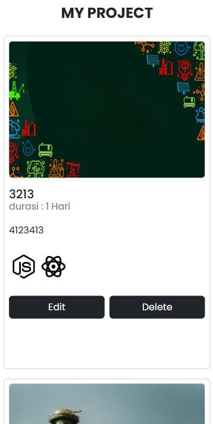
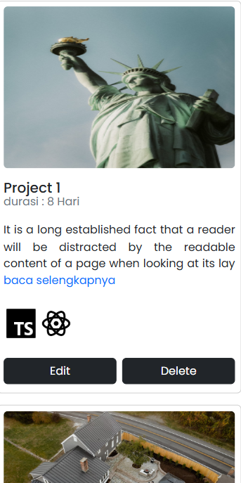

## Penjelasan Aplikasi

Proyek ini merupakan aplikasi web yang dikembangkan menggunakan Express JS, Handlebars, dan Sequelize ORM untuk mengelola operasi CRUD (Create, Read, Update, Delete). Aplikasi ini dibuat sebagai salah satu tugas dari Bootcamp Dumbways dan menggunakan PostgreSQL sebagai database. Selain itu, aplikasi ini juga memanfaatkan SweetAlert untuk memberikan notifikasi yang interaktif dan user-friendly.

## Fitur

- Create New Project
- Update existing Project
- Delete Project
- Show all project and show detail project
- validasi jika tanggal start project kurang dari selesai project dengan bantuan sweet alert

Deskripsi Pada daftar project akan menampilkan **Baca Selengkapnya** jika panjang deksripsi melebihi 120 Karakter dan masih banyak lagi

## Installation

1. Clone the repository:

   ```bash
   git clone https://github.com/Ripaldiansyah/my-project-app-dumbways.git

   ```

2. Navigate to the project folder:

   ```bash
   cd my-project-app-dumbways

   ```

3. Open with vscode:
   ```bash
   code .
   ```
4. install dependency :
   ```bash
   npm install
   ```
5. sesuaikan username dan password database
   ```bash
   src/config/config.json
   ```
6. Run migration
   ```bash
   npx sequelize db:migrate
   ```
7. Run seeder
   ```bash
   npx sequelize-cli db:seed:all
   ```
8. start with NPM
   ```bash
   npm run dev
   ```

## Screenshots

### Home

| Desktop                                       | Mobile                                                   |
| --------------------------------------------- | -------------------------------------------------------- |
|                  |                |
|  |  |

---

### Fitur untuk Menambahkan Project

| Desktop                                                               | Mobile                                                                             |
| --------------------------------------------------------------------- | ---------------------------------------------------------------------------------- |
|                          |                          |
|     |     |
|  |  |
|  |  |
|  |  |
|  |  |

---

### Daftar Project

| Desktop                                          | Mobile                                                           |
| ------------------------------------------------ | ---------------------------------------------------------------- |
|  |     |
|                                                  |  |

---

### Explore & Delete Project

| Desktop                                                                 | Mobile                                                                               |
| ----------------------------------------------------------------------- | ------------------------------------------------------------------------------------ |
|     |     |
|  |  |

---

### Fitur Edit Project

| Desktop                                      | Mobile                                                    |
| -------------------------------------------- | --------------------------------------------------------- |
|  |  |

---

### Halaman Kontak

| Desktop                                                     | Mobile                                                                   |
| ----------------------------------------------------------- | ------------------------------------------------------------------------ |
|                          |     |
|     |  |
|  |  |
|  |                                                                          |
